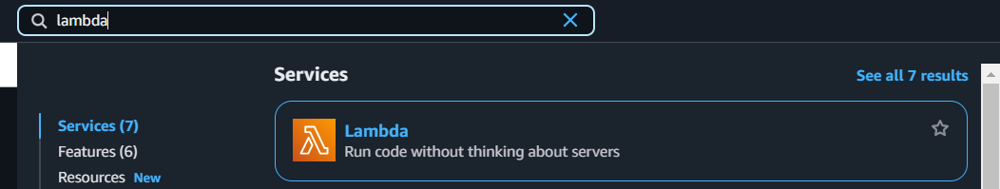
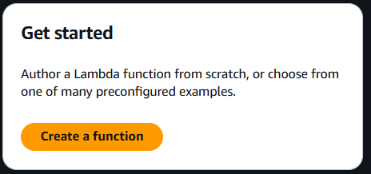
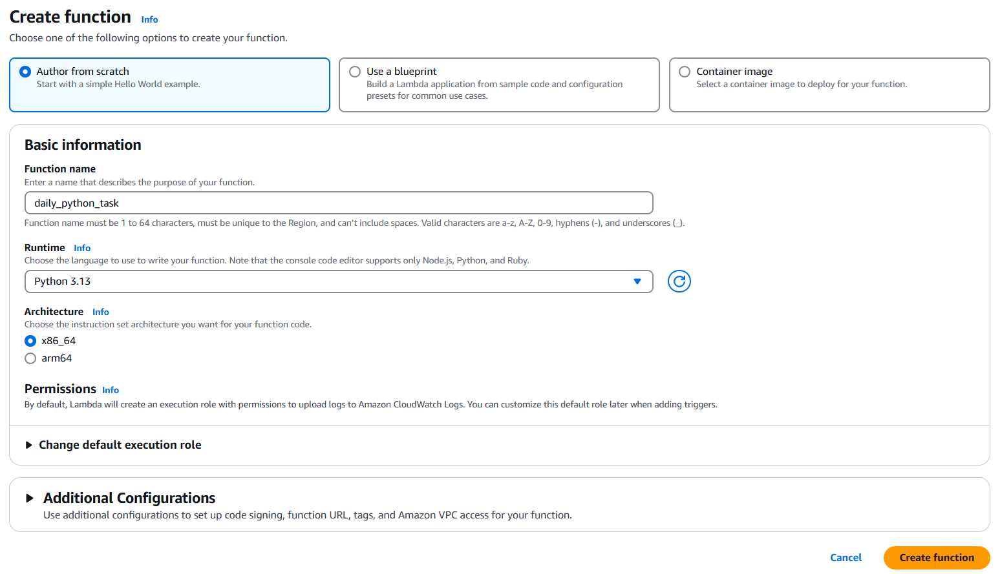
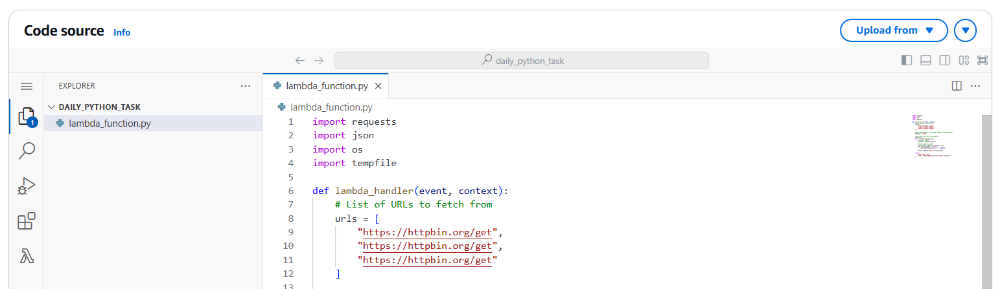
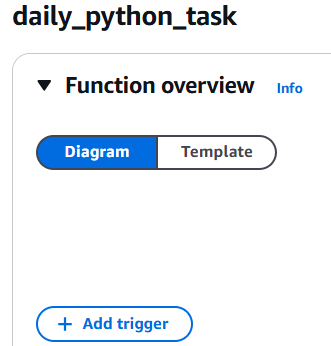
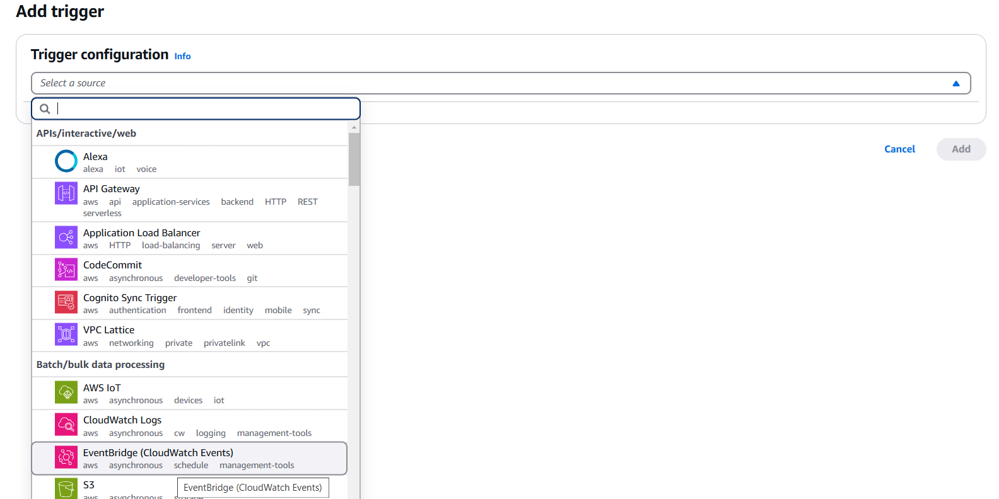
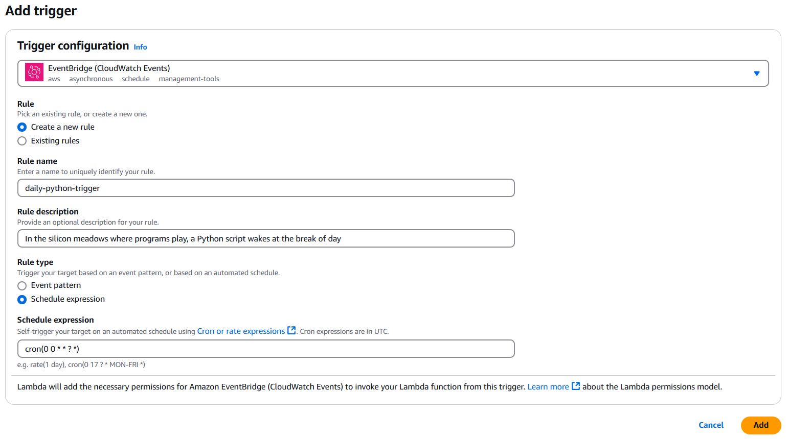

© The Chancellor, Masters and Scholars of The University of Oxford. All rights reserved.

Scheduling a Python program to run daily in AWS

# Instructions

Step 1. Go to the AWS Console and type "Lambda" in the search bar

***

Step 2. Press "Create a function"

***

Step 3. Configure the function 

Choose "Author from scratch", Python, and a name for your function (for example: daily_python_task)

***

Step 4. Paste the code in the editor 

***

Step 5. Press "Add trigger" 

***

Step 6. Set the source of the trigger 

It should be EventBridge

***

Step 7. Create the trigger rule

Give it a name (for example: daily_python_trigger), setup the Schedule Expression, for example cron(0 0 * * ? *) (runs daily at midnight UTC)

***

